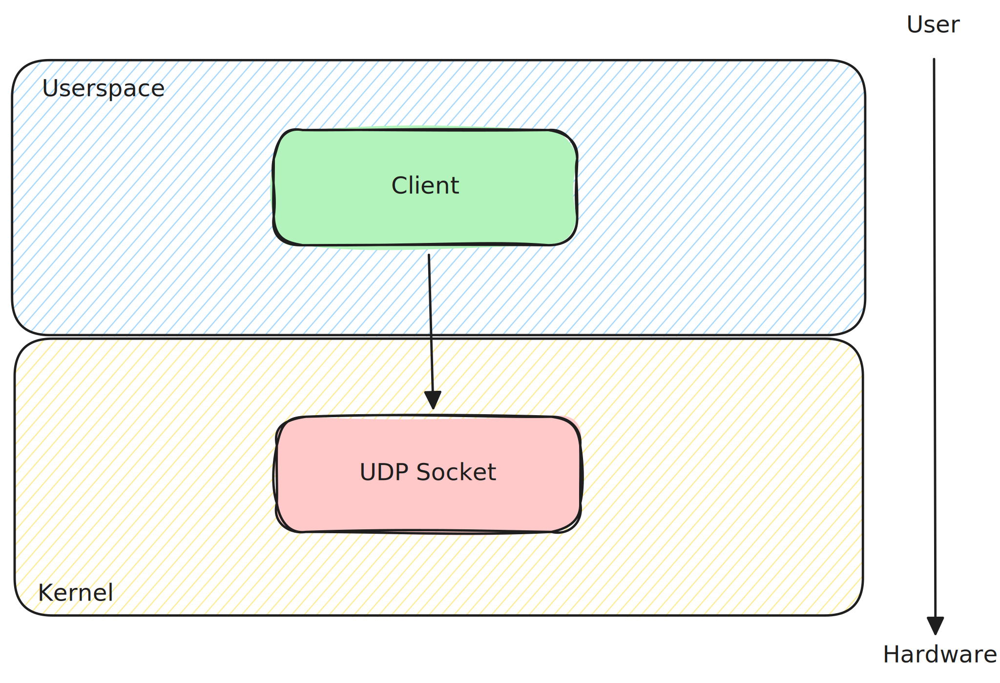
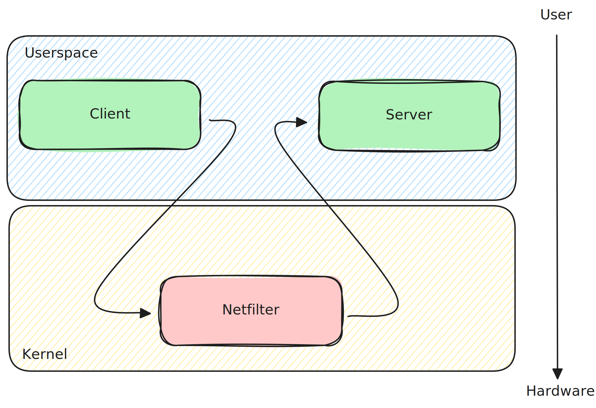

# protobuf_lkm

## Project Goal
[**Protobuf**](https://protobuf.dev/) or **Protocol Buffer** is a language-neutral, platform-neutral mechanism for serializing structured data into a binary format that can be sent over the network.

The flow for developing an application using protobuf is like this:
1. The user writes or receives a `.proto` file containing the message specification.
2. Through some libraries, some code in the target language is generated from the `.proto` file.
    - The classes/structs corresponding to the specified message.
    - The code for converting these structs into the binary format which can then be sent through the network.
3. The user uses the generated code to implement his/her application.

Protobuf is the main encoding format used by [gRPC](https://grpc.io/), a widely used open-source communication framework created by Google.

Protobuf and gRPC are used extensively in cloud-native environments, particularly in microservices architectures.

Some famous examples of projects that use protobuf are:
  - [Kubernetes](https://github.com/kubernetes/kubernetes) uses gRPC for communication between its components and to allow the user to probe his/her deployments for health and readiness status.
  - [Open Telemetry](https://opentelemetry.io/) uses gRPC as a fast way to send traces and logs.
  - [Cloudflare](https://blog.cloudflare.com/moving-k8s-communication-to-grpc/) moved to gRPC for some of its DNS services.

The Project goal is to port a protobuf serialization/deserialization library inside the Linux kernel.

> This is a university project and I am barely aware of what I am doing, so, please, **DO NOT USE THIS IN PROD** as it is.

## Project description
This project aims to port the [pbtools](https://github.com/eerimoq/pbtools) Python library to the Linux kernel.

The project consists of the same two parts of the source library:
- **Core Serialization/Deserialization Logic**: This part has been modified to work within the kernel environment.
These modifications primarily involved substituting user-space headers with their kernel equivalents. Additionally,
generic unsigned 32-bit and 64-bit data types were employed instead of floating-point representations (floats and
doubles) to not require the use of the FPU.
- **Python Code Generation Module**: This module was significantly modified to generate a complete Linux kernel
module. To demonstrate the project’s functionality, the generated module can implement one of two different
functionalities:

  - **UDP Socket**: This module variant establishes a UDP socket within the kernel, enabling the reception of Protobuf-encoded messages. 
  - **Netfilter Hook**: This module registers a netfilter hook that can filter protobuf-encoded TCP packets.
  
It’s important to note that the ‘.proto’ file itself does not specify any actions. Consequently, the generated module
does not implement any logic using the code generated from that file. 

However, the module incorporates logic designed to implement the aforementioned functionalities (UDP socket reception and netfilter hook integration) and provides a function where the user can write his/her code.
Notably, the generated module is designed to build and load successfully without requiring user intervention.
However, in this initial state, it will primarily output debug messages to aid in further development and troubleshooting.

They module always assume that the protobuf messages are prepended with the encoded message size in a 32-bit format.

```text
message:

+-----------------+---------------------------------------+
|  message size   |    protobuf-encoded message           |
|    (4 bytes)    |       (message size bytes)            |
+-----------------+---------------------------------------+
```

> There is no use of dynamic memory allocation, se [here](https://pbtools.readthedocs.io/en/latest/#memory-management) for more details

## How to "build"
Since this library is based on [pbtools](https://github.com/eerimoq/pbtools), it is imported as a git submodule, and it is used to compose the python module:
```shell
git submodule update --init --recursive
```
Then run this to build the python module:
```shell
make protobuf_lkm
```

### [UDP Sockets](examples/socket_udp/README.md)

Here an UDP socket is opened inside the LKM to receive a protobuf message.

Here is an overview of the main part of the model's flow:
1. Inside the `main.c` the `<your_mod_name>_init` opens a UDP socket and waits for a single packet on `INADDR_LOOPBACK`:`MY_UDP_PORT` (`localhost:60001` by default).
2. Once the packet is received (by `kernel_recvmsg()`), the payload is stored inside the `buffer` variable.
3. The main then reads the first 32 bits containing the protobuf length by calling the `extract_message_size(buffer)` function.
4. If the size is > 0 then the `process_message(buffer + 4, size)` function is called. Note that the starting address of the protobuf data is `buffer + 4` as the first 4 bytes are for the size (32 bits).
5. The user is required to fill the  `process_message(char *buffer, int size)` body with the encode/decode for his message, for which functions and structs are provided inside the ` <your_mod_name>.h` that is already included.

> Some placeholder code is placed for debug reason: The code just print the received raw data in hex format.

#### Example Usage
> In this example we use the simple proto-file [hello_world.proto](examples/common/hello_world/proto/hello_world.proto)

1. Install the requirements (if you do not have them already):
    - python3
    - python3-env
    - python3-pip
    - make
    - gcc
    - Linux os
    - [Linux build requirements](https://www.kernel.org/doc/html/latest/process/changes.html)
2. Clone this repository and open a terminal inside it
3. Create a Python virtual environment and install dependencies
    ```shell
    make venv
    ```
4. Create a new UDP LKM stub based on the required protobuf file
    ```shell
    export PYTHONPATH=$(shell pwd)
    ./venv/bin/python3 -m protobuf_lkm generate_lkm_source -T udp_socket -o hello_world_udp examples/common/hello_world/proto/hello_world.proto
    ```
5. Enter the newly created folder
    ```shell
    cd hello_world_udp
    ```
7. Open `main.c` and replace the `process_message(char *buffer, int size)` function with this:
    ```C
    static void process_message(char *buffer, int size)
    {
        // create a memory arena to store the structs
        uint8_t workspace[1024];

        // declare a pointer to a new struct of type hello_world_foo_t corresponding to message Foo
        struct hello_world_foo_t *hello_world_str;

        // allocate a new Foo struct inside the arena and save the pointer
        hello_world_str = hello_world_foo_new(&workspace[0], sizeof(workspace));
        WARN_ON(hello_world_str == NULL);

        // deserialize the binary payload into the previously created struct
        hello_world_foo_decode(hello_world_str, buffer, size);

        // print the Foo.bar value
        int bar = (int) hello_world_str->bar;
        pr_info("received: %d", bar);
    }
    ```
6. Compile, install and load the module
    ```shell
    make
    ```
7. Run a client application (for simplicity we will use the one inside the [examples](examples/socket_udp/hello_world/user_space))
    ```shell
    cd ../examples/socket_udp/hello_world/user_space
    make run
    ```
8. Input some numbers
9. Exit the app by `ctrl-c`
10. Move back to the module folder
    ```shell
    cd ../../../../hello_world_udp
    ```
11. Unload the module
    ```shell
    make unload
    ```
12. Read module output: you should see the number you sent printed out.
    ```shell
    dmesg
    ```

### [Netfilter](examples/netfilter/README.md)

Here the module is used to filter TCP packets between two applications and apply some drop logic based on the protobuf content.

Here is an overview of the main part of the model's flow:
1. Inside the `main.c` the `<your_mod_name>_init` registers the function `hook_func` to be triggered every time a packet matches these rules:
    - The packet is sent to this machine (`NF_INET_LOCAL_IN`)
    - The packet is IPv4 (`PF_INET`)
2. The `hook_func()` function then selects only the packets that:
    - Are TCP
    - Are directed to localhost (`INADDR_LOOPBACK`)
    - Are directed to `MY_PORT` (by default is 60001)
    - Have the `PSH` flag set to `1`
3. The `hook_func()` also ensures that the selected packets are linearized (their payload is all contiguous) so that we can read it as a contiguous byte array. It then calls `handle_tcp_payload()`.
4. The `handle_tcp_payload()` function reads the first 32 bits containing the protobuf length by calling `extract_message_size(buffer)`.
5. If the size is > 0 then the `process_message(buffer + 4, size)` function is called. Note that the starting address of the protobuf data is `buffer + 4` as the first 4 bytes are for the size (32 bits).
6. The user is required to fill the  `process_message(char *buffer, int size)` body with the code for encoding/decoding his/her message(s) (for which functions and structs are provided inside the ` <your_mod_name>.h` that is already included) and the logic to decide the message's fate.
> The function should return an int corresponding to a netfilter response es: NF_ACCEPT, NF_DROP.

#### Example Usage
> In this example we use the simple proto-file [hello_world.proto](examples/common/hello_world/proto/hello_world.proto)

1. Install the requirements (if you do not have them already):
    - python3
    - python3-env
    - python3-pip
    - make
    - gcc
    - Linux os
    - [Linux build requirements](https://www.kernel.org/doc/html/latest/process/changes.html)
2. Clone this repository and open a terminal inside it
3. Create a Python virtual environment and install dependencies
    ```shell
    make venv
    ```
4. Create a new UDP LKM stub based on the required protobuf file
    ```shell
    export PYTHONPATH=$(shell pwd)
    ./venv/bin/python3 -m protobuf_lkm generate_lkm_source -T netfilter -o hello_world_nf examples/common/hello_world/proto/hello_world.proto
    ```
5. Enter the newly created folder
    ```shell
    cd hello_world_nf
    ```
7. Open `main.c` and replace the `process_message(char *buffer, int size)` function with this:
    ```C
    unsigned int process_message(char *buffer, int size)
    {
        // create a memory arena to store the structs
        uint8_t workspace[1024];

        // declare a pointer to a new struct of type hello_world_foo_t corresponding to message Foo
        struct hello_world_foo_t *hello_world_str;

        // allocate a new Foo struct inside the arena and save the pointer
        hello_world_str = hello_world_foo_new(&workspace[0], sizeof(workspace));
        WARN_ON(hello_world_str == NULL);

        // deserialize the binary payload into the previously created struct
        hello_world_foo_decode(hello_world_str, buffer, size);

        // print received Foo.bar value
        int bar = hello_world_str->bar;
        pr_info("received: %d", bar);

        // if the value is greater than 19 DROP the message
        if ( bar >= 20) {

            pr_info("%d > 20 => DROPPING", bar);
            return NF_DROP;
        }

        // otherwise accept it
        return NF_ACCEPT;
    }
    ```
6. Compile, install and load the module
    ```shell
    make
    ```
7. Run the server application (for simplicity we will use the one inside the [examples](examples/netfilter/hello_world/user_space))
    ```shell
    cd ../examples/netfilter/hello_world/user_space
    make server
    ```
8. Open another shell in the same path and run the client
    ```shell
    make client
    ```
9. Input some numbers, you should see that if you send a number >= 20 the server does not receive the packet.
10. Exit the app by `ctrl-c`
11. Move back to the module folder
    ```shell
    cd ../../../../hello_world_udp
    ```
12. Unload the module
    ```shell
    make unload
    ```
13. Read module output: you should see the number you sent and the drop messages printed out.
    ```shell
    dmesg
    ```

## Float support
Since floats are not commonly used inside the kernel some special attention has to be paid when the module needs to make float operations:

This project changed the original pbtools' float types:

| pbtools | protobuf_lkm |
|---------|-------------|
| float   | uint32_t    |
| double  | uint64_t    |

This way the FPU does not have to be enabled if the float values are not processed inside the module.

### Instructions
> These instructions are intended for x86_64 platform (tested on EPYC processor)

> You can find a working example [here](examples/netfilter/floats/module/main.c)
1. Include the float headers inside `main.c`
   ```C
   #include <asm/uaccess.h>
   #include <asm/fpu/api.h>
   ```
2. Keep all the code that handles the float operation tight together
3. Surround this part of the code with the FPU enable/disable:
   ```C
   // declare var to store irq flags
   unsigned long flags;
   
   // Save the current FPU state
   local_irq_save(flags);
   kernel_fpu_begin();
   
   /*
    * Put your float code here
    */
    
   // Restore the saved FPU state
   kernel_fpu_end();
   local_irq_restore(flags);
   ```
4. To convert the variables from uintXX_t to float/double you can use this method:
5. Add these flags to your makefile
   ```makefile
   EXTRA_CFLAGS   	+= -msoft-float -msse -msse2 -msse3 -msse4
   ```
> This part is highly architecture dependant see [here](https://stackoverflow.com/questions/1556142/sse-register-return-with-sse-disabled) for more details

## Limitations
The project is based [eerimoq/pbtools][pbtools] and shares its limitations:

- Options, services (gRPC) and reserved fields are ignored.
- Public imports are not implemented.

## Roadmap
- [ ] Support for eBPF filter generation

## Special thanks to
- [eerimoq/pbtools][pbtools] for the library I used for the port
- [gschwaer/vscode-kernel-module][vscode-kernel-module] for the vscode setup
- [phip1611/cmake-kernel-module][cmake-kernel-module] for the clion setup
- [Linux-Kernel-Programming-Part-2][LKP-2] for the module Makefile template
- [linux-kernel-labs][linux-kernel-labs] for the guides on how to use sockets inside the kernel


[protocol-buffers]: https://developers.google.com/protocol-buffers
[proto3]: https://developers.google.com/protocol-buffers/docs/proto3
[pbtools]: https://github.com/eerimoq/pbtools
[vscode-kernel-module]: https://github.com/gschwaer/vscode-kernel-module
[cmake-kernel-module]: https://gitlab.com/phip1611/cmake-kernel-module
[linux-kernel-labs]: https://linux-kernel-labs.github.io/refs/heads/master/labs/networking.html
[LKP-2]: https://github.com/PacktPublishing/Linux-Kernel-Programming-Part-2